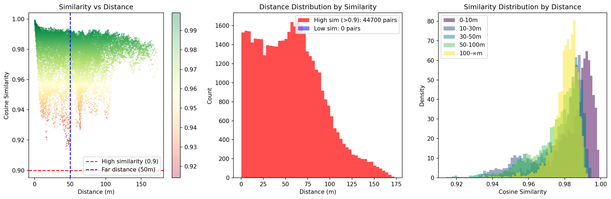
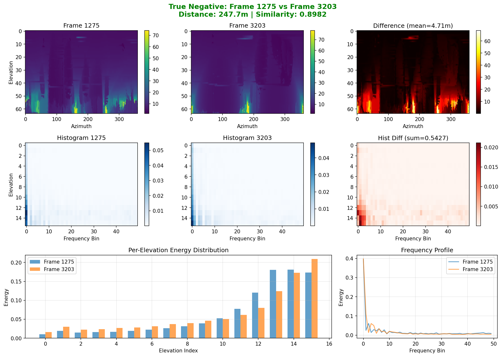
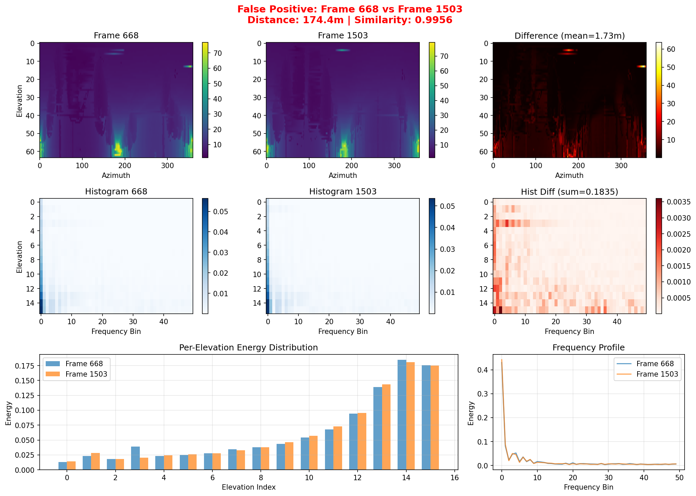

# Perceptual Aliasing Analysis

---

## 1. 개요

### 1.1 분석 목적

**핵심 질문**: 멀리 떨어진 두 장소에서 descriptor가 비슷하게 나올 때, 실제로 시각적으로도 비슷한가?

### 1.2 Perceptual Aliasing이란?

**정의**: 서로 다른 장소가 비슷한 descriptor를 가지는 현상

| 유형 | 설명 |
|-----|------|
| Legitimate Aliasing | 실제로 비슷한 환경 → descriptor도 비슷 (정상) |
| Descriptor Failure | 다른 환경인데 descriptor가 구분 못함 (문제) |

---

## 2. 실험 설계

### 2.1 데이터셋

| 항목 | 값 |
|------|-----|
| Dataset | KITTI Sequence 00 |
| Total Frames | 4,541 |
| Sensor | HDL-64E |

### 2.2 분석 방법

1. 800D per-elevation histogram descriptor 계산
2. 모든 쌍의 cosine similarity 계산
3. 세 가지 유형 추출:
   - **True Positive**: 거리 < 20m, 유사도 > 0.99
   - **True Negative**: 거리 > 100m, 유사도 < 0.95
   - **False Positive**: 거리 > 100m, 유사도 > 0.98

---

## 3. 실험 결과

### 3.1 Similarity vs Distance 분포

| 거리 범위 | 평균 유사도 |
|-----------|------------|
| 0-10m | 0.9847 |
| 10-50m | 0.9762 |
| 100m+ | 0.9804 |

**관찰**: 거리가 멀어져도 유사도가 크게 떨어지지 않음

### 3.2 대표 쌍 분석

#### True Negative (실제로 다른 환경)

**Frame 1275 vs Frame 3203**

| 항목 | 값 |
|------|-----|
| 거리 | 247.7m |
| 유사도 | 0.8982 |

- Range Image가 확연히 다름
- Per-elevation energy 분포도 다름
- 유사도 0.898로 적절히 낮음 → **Descriptor가 잘 구분**

#### False Positive (멀지만 비슷)

**Frame 668 vs Frame 1503**

| 항목 | 값 |
|------|-----|
| 거리 | 174.4m |
| 유사도 | 0.9956 |

- Range Image가 **실제로 비슷함**
- 두 장소 모두 유사한 도로 환경
- **Legitimate Aliasing** (Descriptor 정상 동작)

#### True Positive (Loop Closure)

**Frame 576 vs Frame 3537**

| 항목 | 값 |
|------|-----|
| 거리 | 0.5m |
| 유사도 | 0.9987 |

- 같은 장소 재방문
- 유사도 0.999 → **Loop Closure 성공**

---

## 4. 유사도 범위별 해석

| 유사도 | 해석 |
|--------|------|
| 0.99+ | 같은 장소 또는 거의 동일한 환경 |
| 0.95-0.99 | 비슷한 구조의 환경 |
| 0.90-0.95 | 다른 환경이지만 일부 유사성 |
| < 0.90 | 확연히 다른 환경 |

---

## 5. 결론

### 5.1 핵심 발견

| 질문 | 답변 |
|------|------|
| Descriptor가 비슷하면 실제로 비슷한가? | **Yes** |
| Descriptor 문제인가? | **No** - Legitimate Aliasing |
| GNN이 왜 필요한가? | Trajectory 기반 구분 |

### 5.2 Perceptual Aliasing 원인

KITTI 00의 특성:
- 대부분 직선 도로 환경
- 비슷한 구조 반복 (양쪽 건물, 중앙 도로)
- 다른 장소여도 구조적으로 유사

### 5.3 GNN의 역할

| Before GNN | After GNN |
|------------|-----------|
| Frame A, B 모두 도로 → 유사도 0.99 | Frame A: 주거지역 → 교차로 → 도로 |
| 구분 불가능 | Frame B: 공원 → 직선 → 도로 |
| | Trajectory가 다름 → 구분 가능 |

### 5.4 Per-Elevation Histogram의 효과

True Negative에서 확인:
- Frame 1275 (건물): 상단 elevation 에너지 집중
- Frame 3203 (개방): 하단 elevation 에너지 집중
- Per-elevation 분포 차이로 유사도 0.898

---

## 6. 향후 분석 방향

1. 회전이 많은 시퀀스 분석 (KITTI 05)
2. Cross-sensor 분석 (HeLiPR vs KITTI)
3. GNN 전후 비교 정량화

---

**문서 생성일:** 2026-01-28
